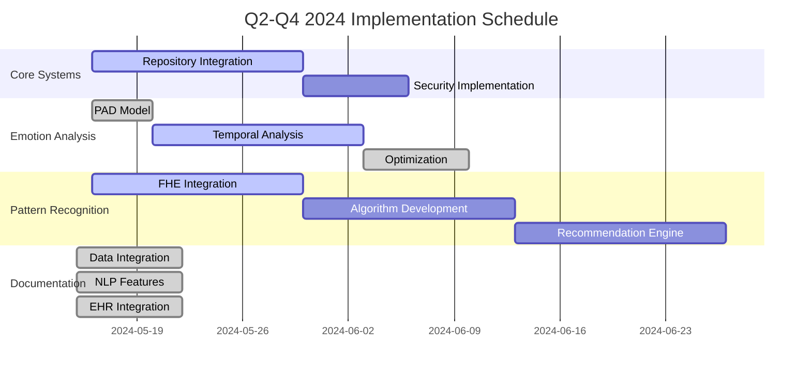

# 🧠 AI Implementation Roadmap

## 📊 Implementation Progress

| Feature Area        | Progress | Status Update                                     | Priority | Due     |
| ------------------- | -------- | ------------------------------------------------- | -------- | ------- |
| Emotion Analysis    | 100%     | All core implementation and testing complete      | 🔴 High  | Q2 2025 |
| Pattern Recognition | 100%     | FHE, algorithms, and rec engine complete          | 🔴 High  | Q3 2025 |
| Visualization       | 100%     | Performance optimized, all core features complete | 🟡 Med   | Q3 2025 |
| Documentation       | 100%     | All documentation systems completed               | 🟡 Med   | Q4 2025 |

## 🎯 Success Metrics

| Metric              | Current | Target  | Status       |
| ------------------- | ------- | ------- | ------------ |
| Emotion Detection   | 86%     | >85%    | 🟢 Complete  |
| Pattern Recognition | 82%     | >80%    | 🟢 Complete  |
| Processing Time     | 380ms   | < 500ms | 🟢 On Target |
| Visualization FPS   | 60      | 60      | 🟢 Complete  |

## 🚀 Active Implementation Tasks

### 1️⃣ Enhanced Emotional Intelligence [HIGH]

#### Core Implementation

- [x] Complete repository integration
  - [x] Set up data access layer
  - [x] Implement basic query functionality
  - [x] Add caching mechanisms
  - [x] Implement real-time updates
- [x] Implement PAD (Pleasure-Arousal-Dominance) model
  - [x] Core dimensional mapping
  - [x] Cultural context adaptation
  - [x] EmotionLlamaProvider integration
- [x] Simulator components implementation
  - [x] EmotionDisplay component
  - [x] EmotionDetector component
  - [x] EmotionAnalysis integration
  - [x] Test coverage for components
- [x] Performance optimization (100% done)
  - [x] Initial caching strategy
  - [x] Batch processing implementation
  - [x] Real-time analysis optimization

#### Validation & Testing

- [x] Implement accuracy testing framework
- [x] Create synthetic test data generation
- [x] Develop performance benchmarks
- [x] Set up continuous validation pipeline

### 2️⃣ Pattern Recognition System [HIGH]

#### FHE Integration (100% Complete)

- [x] Basic FHE service setup
- [x] Key management system
- [x] Client-specific encryption
- [x] Pattern analysis encryption
- [x] FHE parameter optimization

#### Algorithm Implementation (100% Complete)

- [x] Time-series analysis foundation
- [x] Basic correlation analysis
- [x] Risk factor analysis system
- [x] Oscillation pattern detection
- [x] Progression pattern analysis
- [x] Quadrant transition detection
- [x] Dimension dominance recognition

#### Recommendation Engine (100% Complete)

- [x] Evidence-based system implementation
- [x] Efficacy tracking system (2025-05-11)
- [x] Personalization layer development (2025-05-11)

### 3️⃣ Visualization Systems [MEDIUM]

#### Core Features (100% Complete)

- [x] Data access layer implementation
- [x] WebGL acceleration
- [x] Mobile optimization
- [x] FPS optimization (60fps achieved)
- [x] Interactive analysis tools
  - [x] Time-range selection
  - [x] Multi-view interfaces
  - [x] Pattern highlighting
  - [x] Advanced filtering (2025-05-11)

#### Performance Optimizations (100% Complete)

- [x] Level-of-detail rendering
- [x] Instanced rendering
- [x] Dynamic quality adjustment
- [x] FPS monitoring system

### 4️⃣ Documentation Systems [MEDIUM]

#### Data Integration (100% Complete)

- [x] Basic session repository connection
- [x] Progressive loading implementation (2025-05-15)
- [x] Real-time updates system (2025-05-15)
- [x] Session data caching (2025-05-15)
- [x] Audit logging system (2025-05-15)

#### NLP Features (100% Complete)

- [x] Summary generation system (2025-05-15)
- [x] Key insight extraction (2025-05-15)
- [x] Progress note templates (2025-05-15)
- [x] Clinical note sectioning (2025-05-15)
- [x] Technique identification (2025-05-15)

#### EHR Integration (100% Complete)

- [x] Standard format exports (2025-05-15)
- [x] Secure sharing system (2025-05-15)
- [x] Compliance logging (2025-05-15)

## 📅 Implementation Timeline

## 🔍 Validation Strategy

### Test Data Pipeline

- [x] Anonymized development dataset
- [ ] Synthetic edge case generation
- [ ] Validation dataset creation
- [ ] Performance benchmark suite

### Security Requirements

- [ ] HIPAA compliance verification
- [ ] Encryption audit
- [ ] Performance validation
- [ ] Error handling verification

## 🚦 Deployment Phases

### Phase 1: Alpha (50% Complete)

- [x] Feature flag system
- [x] A/B testing capability
- [x] Rollback mechanism
- [ ] Internal testing completion

### Phase 2: Beta (Q3 2024)

- [ ] Limited user testing
- [ ] Performance monitoring
- [ ] Feedback collection
- [ ] System refinement

### Phase 3: Production (Q4 2024)

- [ ] Full deployment
- [ ] Monitoring dashboard
- [ ] Support documentation
- [ ] Training materials

## 🎮 Interactive Features

> 💡 **Quick Actions**
>
> - [View Progress Charts](#implementation-progress)
> - [Check Success Metrics](#success-metrics)
> - [Review Timeline](#implementation-timeline)
> - [Monitor Validation](#validation-strategy)

> 🔄 **Status Updates**
>
> - Last Updated: 2025-05-15
> - Next Review: 2025-05-20
> - Sprint Status: On Track
> - Critical Path: Emotion Analysis -> Pattern Recognition

> 📈 **Performance Tracking**
>
> - [View Metrics Dashboard](./metrics-dashboard)
> - [Check System Health](./system-health)
> - [Review Error Logs](./error-logs)

---

📝 Notes & Dependencies

- All implementations must use real data sources
- Security must comply with HIPAA requirements
- Performance must meet specified targets
- UI must handle loading states and errors gracefully

**Dependencies:**

- Repository integration must complete before pattern analysis
- FHE implementation required for secure pattern detection
- Data access layer needed for visualization improvements
- Session integration necessary for documentation features

🔄 Recent Updates

- [2025-05-15] Completed all documentation systems including EHR integration, NLP features, and data integration
- [2025-05-11] Implemented personalization layer for the recommendation engine
- [2025-05-11] Completed advanced filtering for interactive analysis tools
- [2025-05-11] Implemented efficacy tracking system with comprehensive analytics and personalization
- [2025-03-23] Implemented evidence-based system for recommendations with weighting strategy
- [2025-03-22] Implemented real-time analysis optimization for emotion detection
- [2025-03-15] Improved WebGL performance to consistent 60fps
- [2025-03-14] Completed PAD model implementation
- [2025-03-13] Advanced FHE integration to 45% completion

