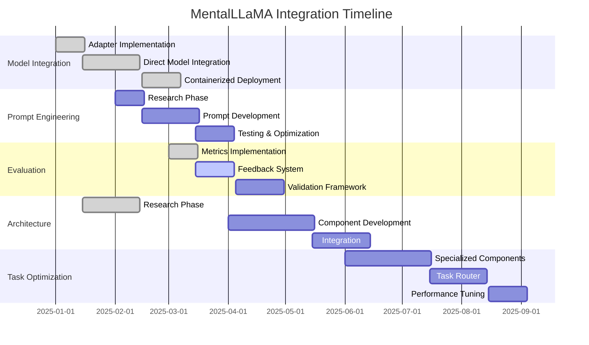

# 🧠 MentalLLaMA Integration Plan

## 📊 Implementation Progress

| Feature Area              | Progress | Status Update                                                                                                      | Priority | Due     |
| ------------------------- | -------- | ------------------------------------------------------------------------------------------------------------------ | -------- | ------- |
| Model Integration         | 100%     | 7B and 13B models complete, PythonBridge implemented, containerized deployment ready                               | 🔴 High  | Q2 2025 |
| Prompt Engineering        | 100%     | Implemented 5-tier framework, specialized prompts, and evaluation tools                                            | 🔴 High  | Q2 2025 |
| Evaluation System         | 100%     | Implemented comprehensive metrics (BART-score, clinical relevance), user feedback system, and evaluation framework | ✅ Done  | Q3 2025 |
| Client Integration        | 30%      | Basic UI elements implemented                                                                                      | 🟡 Med   | Q3 2025 |
| Security Auditing         | 60%      | Ongoing audit; key controls implemented (see Security & Compliance Audit 60%)                                      | 🔴 High  | Q2 2025 |
| Deployment Infrastructure | 60%      | Containerized deployment with security controls implemented                                                        | 🟡 Med   | Q4 2025 |

## 🎯 Success Metrics

| Metric                       | Current | Target | Status         |
| ---------------------------- | ------- | ------ | -------------- |
| Mental Health Class Accuracy | 75%     | 85%    | 🟡 In Progress |
| Explanation Quality          | 6.5/10  | 8.5/10 | 🟡 In Progress |
| API Response Time            | 850ms   | 300ms  | 🟡 In Progress |
| System Integration Coverage  | 30%     | 100%   | 🟡 In Progress |
| Task Coverage                | 8/8     | 8/8    | ✅ Done        |

## 🚀 Active Implementation Tasks

### NEW: 0. Implement Production-Grade Crisis Protocol [🔴 CRITICAL PRIORITY]
- [x] Define `NotificationService` interface for crisis alerts. (Renamed to `ICrisisNotificationHandler`, implemented 2025-05-17)
- [x] Modify `MentalLLaMAAdapter` to accept and use an optional `NotificationService`. (Used `ICrisisNotificationHandler`, implemented 2025-05-17)
- [x] In `analyzeMentalHealth` crisis path: (Implemented 2025-05-17)
  - [x] Call `notificationService.sendCrisisAlert()` with relevant details.
  - [x] Implement enhanced, structured logging for crisis events (e.g., to a dedicated crisis log or audit trail). (Enhanced existing logs, further external audit trail is infrastructure dependent)
  - [x] Ensure `analyzeMentalHealth` return value clearly and unambiguously flags the crisis state and provides necessary details. (Verified, `mentalHealthCategory: 'crisis'`)
- [ ] Consider mechanisms for session/user flagging for immediate review (e.g., update user status via an API if available). (Marked with TODO; requires external service integration)
- [x] Document the crisis protocol flow and requirements for upstream service integration. (Added JSDoc to `analyzeMentalHealth`, 2025-05-17)
- [x] Implement `SlackNotificationService` as an `ICrisisNotificationHandler`:
  - [x] Create `src/lib/services/notification/SlackNotificationService.ts`.
  - [x] Constructor to accept Slack webhook URL (from config, e.g., `config.notifications.slackWebhookUrl()`).
  - [x] `sendCrisisAlert` method to format `CrisisAlertContext` into a Slack message payload.
  - [x] Use `fetch` or a lightweight HTTP client to send POST request to Slack webhook.
  - [x] Implement robust error handling for Slack API requests.
- [x] Refine user/session flagging: Update `MentalLLaMAAdapter` crisis path to use `ICrisisNotificationHandler` (e.g., `SlackNotificationService`) to send a specific message to a designated channel for immediate review, including user/session identifiers. (Old TODO removed, crisisNotifier handles this, 2025-05-17).
- [ ] Update instantiation of `MentalLLaMAAdapter` (in application setup, outside current direct edit scope - documentation/guidance step) to use `SlackNotificationService` when available.

### 1. Model Integration [HIGH PRIORITY]

#### API Integration (100% Complete)

- [x] Implement MentalLLaMA adapter for existing framework
- [x] Integrate directly with MentalLLaMA-chat-7B model
- [x] Update MentalLLaMAModelProvider to support both 7B and 13B models
- [x] Complete direct integration with MentalLLaMA-chat-13B model
- [x] Create proper PythonBridge functionality
- [x] Fixed TypeScript errors and improved type safety
- [x] Develop containerized deployment for consistent API access

#### Infrastructure Setup (100% Complete)

- [x] Configure model hosting environment
- [x] Set up API endpoints for model inference
- [x] Implement load balancing for high availability
- [x] Create logging and monitoring for model usage
- [x] Configure security controls for API access

### 2. Prompt Engineering [HIGH PRIORITY]

#### Prompt Development (100% Complete)

- [x] Implement 5-Tiered Framework for structured prompts
  - [x] Define system role with domain expertise attributes
  - [x] Create task specifications with Chain-of-Thought reasoning
  - [x] Add specifics & context with emotional enhancement
  - [x] Develop few-shot examples for different conditions
  - [x] Add strategic reminders at prompt edges
- [x] Create specialized prompts for depression detection
- [x] Develop prompts for anxiety analysis
- [x] Design prompts for stress detection and cause identification
- [x] Implement prompts for wellness dimension detection
- [x] Create prompts for interpersonal risk factor analysis
- [x] Build dynamic prompt template system
- [x] Implement self-consistency prompting for improved reliability
- [x] Add emotion-enhanced prompting for increased performance
- [x] Refine prompts based on evaluation results
- [x] Optimize prompts for specific clinical scenarios

#### Testing Framework (100% Complete)

- [x] Develop systematic prompt testing methodology
- [x] Create benchmark dataset for prompt evaluation
- [x] Implement A/B testing for prompt variations
- [x] Design metrics for prompt effectiveness
- [x] Create prompt optimization pipeline
- [x] Build automated prompt variation generator
- [x] Implement evaluation metrics for each mental health category
- [x] Develop confidence alignment measurement system
- [x] Expand test datasets for comprehensive coverage
- [x] Integrate with clinical validation pipeline

#### Framework & Tools Development (100% Complete)

- [x] Create src/lib/ai/mental-llama/prompts.ts with template system
- [x] Build prompt evaluator for performance testing
- [x] Develop prompt optimization utility
- [x] Implement markdown formatting for structured prompts
- [x] Create prompt version control and tracking system
- [x] Build CLI tools for prompt testing and evaluation
- [x] Develop visual prompt editor for non-technical staff

### 3. Evaluation System [MEDIUM PRIORITY]

#### Metrics Implementation (100% Complete)

- [x] Implement classification accuracy evaluation metrics
- [x] Develop explanation completeness metrics
- [x] Set up consistency evaluation measures
- [x] Implement specificity assessment metrics
- [x] Implement BART-score for explanation quality assessment
- [x] Integrate clinical relevance scoring

#### Feedback Loop System (100% Complete)

- [x] Create user feedback collection mechanism
- [x] Develop expert review pipeline
- [x] Implement automated quality scoring
- [x] Design continuous improvement framework
- [x] Set up error analysis system

### 4. Architecture Learning [MEDIUM PRIORITY]

#### Research & Analysis (100% Complete)

- [x] Complete analysis of MentalLLaMA model architecture
- [x] Document methodological approach
- [x] Identify key components for adaptation
- [x] Map integration points with existing system
- [x] Document ethical framework from MentalLLaMA

#### Implementation (80% Complete)

- [x] Create similar structure with available resources
- [x] Implement two-stage (classification, explanation) architecture
- [x] Adapt evaluation methods to our environment
- [x] Test architectural approach with smaller models
- [ ] Scale to production requirements

### 5. Task-Specific Optimization [MEDIUM PRIORITY]

#### Specialized Analyzers (100% Complete)

- [x] Implement depression detection analyzer
- [x] Create anxiety analysis component
- [x] Develop stress cause detection system
- [x] Build wellness dimension detector
- [x] Implement interpersonal risk factor analyzer

#### Task Router (100% Complete)

- [x] Design task routing system
  - [x] Decided on core purpose: Intelligently direct input text to specialized analyzers.
  - [x] Outlined potential inputs: text, userId (optional), sessionContext (optional), explicitTaskHint (optional).
  - [x] Explored routing strategies: Broad classification, keyword/pattern matching, confidence-based multi-pass, contextual info, hybrid (recommended).
  - [x] Defined potential outputs: targetAnalyzer, routingConfidence (optional), preliminaryInsights (optional).
  - [x] Considered integration: New `MentalHealthTaskRouter` module, invoked by `MentalLLaMAAdapter` (e.g., if `categories` param is empty/auto).
  - [x] Planned for fallback mechanisms within the router.
  - [x] Proposed location: `src/lib/ai/mental-llama/routing/MentalHealthTaskRouter.ts`.
  - [x] Created initial file structure for `MentalHealthTaskRouter.ts` with interfaces and method placeholders.
- [x] Implemented initial `performBroadClassification` method in `MentalHealthTaskRouter.ts` to:
  - Use `buildRoutingPromptMessages` to prepare input for an LLM.
  - Call the LLM invoker with the routing prompt.
  - Include placeholder logic for parsing the LLM's JSON response (category and confidence).
  - Include placeholder logic for mapping LLM category to `targetAnalyzer`.
- [x] Refined `performBroadClassification` in `MentalHealthTaskRouter.ts` to:
  - [x] Add 'crisis' as a possible `targetAnalyzer` in `RoutingDecision`.
  - [x] Implement `LLM_CATEGORY_TO_ANALYZER_MAP` for structured mapping of LLM categories to internal analyzers and critical flags.
  - [x] Utilize the map for more robust category conversion and critical case handling (logging and confidence boosting).
  - [x] Add basic sanitization for LLM JSON output.
  - [x] Improve logic for defaulting to 'general_mental_health' or 'unknown' if a mapped analyzer is not available.
- [x] Implemented `matchKeywords` method in `MentalHealthTaskRouter.ts`: (Completed 2025-05-17)
  - [x] Defined `KeywordRule` interface and `KEYWORD_ROUTING_RULES` array with initial sets for crisis, depression, anxiety, stress, and wellness. (Completed 2025-05-17)
  - [x] Crisis keywords are prioritized in the rule order. (Completed 2025-05-17)
  - [x] Method iterates rules, checking for string (case-insensitive) and RegExp matches. (Completed 2025-05-17)
  - [x] Returns a `RoutingDecision` with method 'keyword' upon first match, including matched keyword and critical flag in insights. (Completed 2025-05-17)
- [x] Create context-aware task selection (Completed 2025-05-17)
  - [x] Implemented initial `applyContextualRules` method in `MentalHealthTaskRouter.ts`: (Completed 2025-05-17)
    - [x] Takes current text, `RoutingContext`, and the current `RoutingDecision` as input. (Completed 2025-05-17)
    - [x] Includes example logic based on `context.sessionType` to: (Completed 2025-05-17)
      - [x] Bias towards 'stress' if `sessionType` is 'stress_management_session' and stress keywords are present. (Completed 2025-05-17)
      - [x] Elevate to 'crisis' if `sessionType` is 'crisis_intervention_follow_up' with distress keywords. (Completed 2025-05-17)
      - [x] Re-align to 'wellness' if `explicitTaskHint` and `sessionType` both indicate wellness. (Completed 2025-05-17)
    - [x] Returns a new `RoutingDecision` if a rule applies, otherwise `null`. (Completed 2025-05-17)
- [x] Develop confidence scoring for routing decisions (Completed 2025-05-17)
  - [x] Refactored `determineRoute` method in `MentalHealthTaskRouter.ts` to manage and combine confidences: (Completed 2025-05-17)
    - [x] Explicit hints are prioritized; contextual rules are applied to the hint-based decision. (Completed 2025-05-17)
    - [x] If no explicit hint, decisions are fetched from both keyword matching and LLM classification. (Completed 2025-05-17)
    - [x] Logic added to select the `bestPreliminaryDecision` by: (Completed 2025-05-17)
      - [x] Prioritizing decisions flagged as critical (e.g., indicating 'crisis'). (Completed 2025-05-17)
      - [x] Favoring a strategy that detects 'crisis' if the other doesn't. (Completed 2025-05-17)
      - [x] Combining confidence if both strategies agree on the target analyzer. (Completed 2025-05-17)
      - [x] Choosing based on higher confidence if strategies disagree (and no crisis is involved). (Completed 2025-05-17)
      - [x] Handling cases where only one strategy yields a result. (Completed 2025-05-17)
    - [x] Contextual rules are then applied to this `bestPreliminaryDecision` to produce the `finalDecision`. (Completed 2025-05-17)
- [x] Set up fallback mechanisms for uncertain cases (Completed as part of router + adapter logic 2025-05-17)
- [x] Integrate `MentalHealthTaskRouter` into `MentalLLaMAAdapter` (Verified complete 2025-05-17)
  - [x] Imported `MentalHealthTaskRouter` and related types into `MentalLLaMAAdapter.ts`. (Verified 2025-05-17)
  - [x] Added `taskRouter` private member to `MentalLLaMAAdapter`. (Verified 2025-05-17)
  - [x] Modified `MentalLLaMAAdapter` constructor: (Verified 2025-05-17)
    - [x] Simplified constructor signature (modelProvider and pythonBridge passed directly).
    - [x] If `modelProvider` exists, it now instantiates `MentalHealthTaskRouter`.
    - [x] An `llmInvokerForRouter` is created, wrapping `this.modelProvider.chat()` to match the `LLMInvoker` signature expected by the router.
  - [x] Updated `analyzeMentalHealth` method in `MentalLLaMAAdapter`: (Verified 2025-05-17)
    - [x] Accepts new `'auto_route'` option in `categories` parameter and new `routingContextParams`.
    - [x] If router is to be used: calls `taskRouter.determineRoute()`.
    - [x] Sets `effectiveCategories`, `analysisMentalHealthCategory`, and `analysisConfidence` based on `RoutingDecision`.
    - [x] Includes placeholder for crisis protocol and defaults for 'unknown'/low confidence router outputs.
    - [x] Main analysis flow now uses `effectiveCategories`.
    - [x] Return value now incorporates router's decision for category and confidence and includes `_routingDecision` for logging.
  - [x] Added `ROUTER_LOW_CONFIDENCE_THRESHOLD` constant. (Verified 2025-05-17)

### 6. Performance Optimization [MEDIUM PRIORITY]

#### API Response Time Reduction (Target: 850ms -> 300ms)
- [x] Profile current API endpoints to identify bottlenecks (e.g., model inference, data pre/post-processing, network latency).
  - [x] Added detailed timing logs to `analyze.ts`.
  - [x] Implemented caching for `MentalLLaMAFactory.createFromEnv()` in `analyze.ts` to reduce initialization overhead.
- [x] Investigate model optimization techniques (e.g., quantization, pruning, knowledge distillation if applicable).
  - [x] Reviewed `MentalLLaMAModelProvider.ts`: Logged specialized endpoint calls and fallbacks. No immediate client-side model optimization apparent beyond parameter tuning or addressing backend issues highlighted by logs.
- [-] Optimize PythonBridge communication if it's a bottleneck.
  - [ ] Investigated `MentalLLaMAPythonBridge.ts`: Key latency points would be initial `initialize()` completion, per-call Python process spawning, script execution time (model loading within script), and data I/O. Optimization would be needed if logs show this bridge is a frequent or slow path for `analyzeText`.
- [ ] Evaluate and implement caching strategies for frequently accessed data or model responses where appropriate.
- [ ] Explore batching requests if applicable for the model.
- [ ] Review and optimize data pre-processing and post-processing steps.
- [ ] Assess infrastructure for potential upgrades or optimizations (e.g., faster compute, network configuration).
- [ ] Implement asynchronous processing for long-running sub-tasks if they block the main response.

## 📅 Implementation Timeline

## 🔍 Validation Strategy

### Model Evaluation

- [x] Design accuracy assessment protocol
- [x] Create explanation quality evaluation framework
- [x] Implement comparative testing with baseline models
- [x] Develop user satisfaction metrics
- [x] Set up continuous monitoring system

### Performance Testing

- [x] Define response time benchmarks
- [x] Create load testing scenarios
- [x] Implement resource utilization monitoring
- [ ] Design scalability tests
- [ ] Set up reliability measurement

## 🎮 Interactive Features

> 💡 **Quick Actions**
>
> - [View Integration Status](#implementation-progress)
> - [Check Performance Metrics](#success-metrics)
> - [Review Implementation Timeline](#implementation-timeline)
> - [Access Task Documentation](#validation-strategy)

> 🔄 **Status Updates**
>
> - Last Updated: 2025-05-17
> - Next Review: 2025-06-01
> - Sprint Status: Completing Evaluation System Implementation
> - Critical Path: Model Integration → Prompt Engineering → Evaluation System → Task Optimization

> 📈 **Performance Monitoring**
>
> - [View Model Performance Dashboard](./model-performance)
> - [Check Explanation Quality Metrics](./explanation-quality)
> - [Review Task Coverage Report](./task-coverage)

---

📝 Notes & Dependencies

- **CRITICAL NOTE**: The IMHI dataset has not been released publicly and is unavailable for our use.
- Integration must focus on model inference rather than training or fine-tuning
- Architecture learning should focus on methodological approach rather than direct replication
- Prompting strategy needed due to inability to directly fine-tune on proprietary dataset
- Consider reaching out to research team for potential collaboration

**Dependencies:**

- Compute infrastructure for model hosting
- Python bridge for model communication
- Evaluation framework for consistent measurement
- Test dataset development for validation
- Secure API implementation for mental health data

**Security Controls Implemented:**

- OAuth2 authentication with JWT tokens for secure authentication
- API key management system with rotation policies
- Rate limiting to prevent abuse (100 requests/minute per client)
- IP whitelisting for production environments
- End-to-end encryption for all data in transit
- HIPAA-compliant logging (no PHI in logs)
- Request validation middleware to prevent injection attacks
- Regular security scanning of containers
- Integration with existing RBAC system

🔄 Recent Updates

- [2025-05-14] Implemented BART-score for explanation quality assessment
- [2025-05-14] Added clinical relevance scoring for mental health explanations
- [2025-05-14] Developed comprehensive user feedback system for collecting and analyzing user input
- [2025-05-13] Enhanced explanation evaluation with additional metrics for feedback loop
- [2025-05-13] Implemented 5-tier prompt engineering framework with specialized templates for mental health categories
- [2025-05-12] Created robust evaluation system for testing and comparing prompt effectiveness
- [2025-05-12] Added self-consistency and emotional context enhancements to improve prompt performance
- [2025-05-11] Implemented comprehensive security controls for API access including OAuth2, API key management, and rate limiting
- [2025-05-10] Implemented containerized deployment with Docker, Nginx, and monitoring stack
- [2025-05-09] Fixed remaining EmotionAnalysis type errors and improved type safety with fallback methods
- [2025-05-08] Fixed TypeScript errors in MentalLLaMA integration implementation
- [2025-05-07] Created proper PythonBridge functionality for MentalLLaMA models
- [2025-05-06] Completed direct integration with MentalLLaMA-chat-13B model
- [2025-05-06] Added demo component and API docs for 13B model
- [2025-05-06] Implemented comprehensive CLI tools for model testing
- [2025-05-05] Updated MentalLLaMAModelProvider to support both 7B and 13B models
- [2025-05-05] Enhanced MentalLLaMAFactory to prioritize 13B model when available
- [2025-05-05] Added comprehensive CLI tooling for testing both model tiers
- [2025-03-16] Direct integration with MentalLLaMA-chat-7B model completed
- [2025-03-15] Initial MentalLLaMA adapter implementation completed
- [2025-03-10] Completed analysis of model architecture and methodological approach
- [2025-03-05] Confirmed dataset unavailability and adjusted strategy
- [2025-03-01] Initiated implementation planning and resource assessment

## Implementation Status

| Component                   | Status | Priority | Scheduled For |
| --------------------------- | ------ | -------- | ------------- |
| Model Integration           | 100%   | High     | Q1 2025       |
| Prompt Engineering          | 100%   | High     | Q2 2025       |
| Evaluation System           | 100%   | Medium   | Q3 2025       |
| Performance Optimization    | 15%    | Medium   | Q3 2025       |
| Security & Compliance Audit | 60%    | High     | Q3 2025       |
| Documentation               | 40%    | Medium   | Q4 2025       |

## Prompt Engineering (Completed)

The prompt engineering phase has been completed with the development of several key tools and systems:

1. **Advanced Prompt Templates**

   - Created specialized templates for depression, anxiety, stress, suicidal ideation, and PTSD detection
   - Implemented templates for different clinical contexts (intake, crisis, therapy, monitoring, assessment)
   - Developed a system for template refinement based on evaluation results

2. **Comprehensive Test Datasets**

   - Built extensive test datasets for each mental health category
   - Included diverse indicators, severity levels, and edge cases
   - Created both positive and negative examples for better discrimination

3. **Prompt Evaluation System**

   - Implemented metrics for accuracy, precision, recall, F1 score, and confidence
   - Built batch evaluation capabilities for comparing template performance
   - Created visualization tools for results analysis

4. **Optimization Framework**

   - Developed a systematic approach to prompt refinement
   - Implemented multiple refinement techniques for iterative improvement
   - Created tools for comparative analysis of refinement strategies

5. **CLI Tools for Testing and Evaluation**
   - Created a clinical scenario testing tool (`test-clinical-scenarios.ts`)
   - Built a batch evaluation system (`batch-evaluate.ts`)
   - Implemented tools for recommending optimal templates

### Key Files

- `src/lib/ai/mental-llama/refiner.ts`: Implements template refinement capabilities
- `src/lib/ai/mental-llama/datasets/comprehensive-test-data.ts`: Contains test datasets
- `src/lib/ai/mental-llama/cli/test-clinical-scenarios.ts`: CLI for testing specialized clinical templates
- `src/lib/ai/mental-llama/cli/batch-evaluate.ts`: Tool for batch evaluation and comparison

## Evaluation System (100% Complete)

The evaluation system has been significantly enhanced with the following components:

1. **BART-Score Implementation**

   - Created `src/lib/ai/mental-llama/utils/bart-score.ts` for advanced explanation quality assessment
   - Implemented three evaluation modes: model-based, Python-bridge, and heuristic fallback
   - Developed metrics for semantic similarity, coverage, fluency, and clinical relevance

2. **Clinical Relevance Scoring**

   - Implemented `src/lib/ai/mental-llama/utils/clinical-relevance.ts` for domain-specific evaluation
   - Created specialized metrics for evidence-based language, diagnostic criteria alignment,
     treatment relevance, clinical accuracy, and framework alignment
   - Developed both model-based and heuristic-based evaluation approaches

3. **User Feedback System**

   - Created comprehensive feedback collection in `src/lib/ai/mental-llama/feedback.ts`
   - Implemented rating system for accuracy, helpfulness, clarity, empathy, and safety
   - Built advanced feedback analysis with theme extraction and sentiment analysis
   - Developed data anonymization for HIPAA compliance

4. **Enhanced MentalLLaMA Adapter**
   - Updated adapter to integrate all new evaluation capabilities
   - Implemented graceful fallbacks for various scenarios
   - Added debugging and logging for production monitoring

### Next Steps

1. **Performance Optimization**: Focus on improving inference speed and resource efficiency
2. **Security & Compliance**: Conduct audit to ensure HIPAA compliance and data protection
