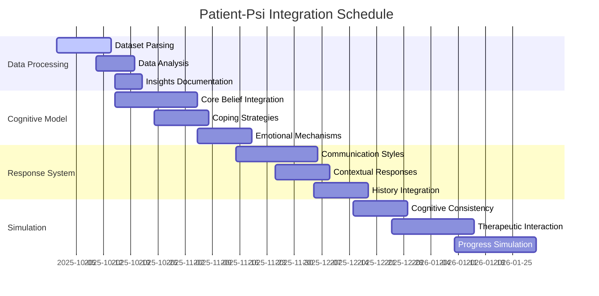

# 🧠 Patient-Psi Dataset Integration Roadmap

## 📊 Implementation Progress

| Feature Area                     | Progress | Status Update                                      | Priority | Due     |
| -------------------------------- | -------- | -------------------------------------------------- | -------- | ------- |
| Dataset Parsing & Pre-processing | 0%       | Ready to begin transformation of raw JSON          | 🔴 High  | Q4 2023 |
| Cognitive Model Enhancement      | 0%       | Planning model augmentation with belief structures | 🔴 High  | Q4 2023 |
| Response Pattern Expansion       | 0%       | Preparing to integrate communication styles        | 🟡 Med   | Q4 2023 |
| Patient Simulation Refinement    | 0%       | Ready to enhance simulation with new profiles      | 🟡 Med   | Q1 2024 |

## 🎯 Success Metrics

| Metric                               | Current | Target  | Status         |
| ------------------------------------ | ------- | ------- | -------------- |
| Cognitive Model Recognition Accuracy | 75%     | >90%    | 🟡 In Progress |
| Emotional Response Appropriateness   | 80%     | >95%    | 🟡 In Progress |
| Communication Style Variation        | 3 types | 5 types | 🟡 In Progress |
| Response Contextual Relevance        | 82%     | >93%    | 🟡 In Progress |

## 🚀 Active Implementation Tasks

### 1️⃣ Dataset Parsing & Pre-processing [HIGH PRIORITY]

#### Data Extraction & Transformation (0% Complete)

- [ ] Create dataset parser utility in `src/lib/ai/datasets/`
  - [ ] Extract patient profiles with core belief structure
  - [ ] Map emotional states to behavioral responses
  - [ ] Categorize communication styles
  - [ ] Generate response templates based on patterns
- [ ] Normalize dataset structure with existing models
  - [ ] Standardize field names and data types
  - [ ] Create linking identifiers between profiles
  - [ ] Implement validation checks for data integrity
- [ ] Build indexing for efficient lookup
  - [ ] Create belief-based indices
  - [ ] Create emotion-based indices
  - [ ] Create situation-based indices

#### Data Analysis & Insights (0% Complete)

- [ ] Generate statistical profile of dataset
  - [ ] Analyze belief distribution across profiles
  - [ ] Map emotional triggers across situations
  - [ ] Identify common coping strategies
- [ ] Create visualization of cognitive patterns
  - [ ] Develop force-directed graph of belief relationships
  - [ ] Map auto-thought to emotion correlations
  - [ ] Visualize behavioral response patterns
- [ ] Document insights for model enhancement
  - [ ] Create reference guide for model engineers
  - [ ] Document pattern templates for validation

### 2️⃣ Cognitive Model Enhancement [HIGH PRIORITY]

#### Three-Tier Belief System Integration (0% Complete)

- [ ] Extend existing cognitive model in `src/lib/ai/models/patient.ts`
  - [ ] Implement core belief detection system
  - [ ] Add intermediate belief reasoning layer
  - [ ] Create situation-specific thought modeling
  - [ ] Implement depression-specific belief patterns
- [ ] Develop emotional triggering mechanisms
  - [ ] Map core beliefs to emotional vulnerabilities
  - [ ] Create emotional intensity scaling based on belief strength
  - [ ] Implement emotional contagion between related beliefs
- [ ] Build adaptive belief adjustment system
  - [ ] Create belief reinforcement mechanisms
  - [ ] Implement belief challenging detection
  - [ ] Add therapeutic progress tracking

#### Coping Strategy Framework (0% Complete)

- [ ] Implement coping strategy recognition
  - [ ] Create pattern matcher for avoidance behaviors
  - [ ] Add recognition for ruminative thinking
  - [ ] Implement detection for cognitive distortions
- [ ] Develop coping strategy response generator
  - [ ] Build templates for common coping mechanisms
  - [ ] Create contextual coping selection system
  - [ ] Add defensive response generation
- [ ] Add coping effectiveness evaluation
  - [ ] Implement short vs. long-term effectiveness comparison
  - [ ] Create adaptive coping selection based on context
  - [ ] Add coping strategy recommendation system

### 3️⃣ Response Pattern Expansion [MEDIUM PRIORITY]

#### Communication Style Enhancement (0% Complete)

- [ ] Implement five communication styles from dataset
  - [ ] Create plain communication style templates
  - [ ] Add verbose/tangential response generation
  - [ ] Implement hostile communication patterns
  - [ ] Add guarded response mechanisms
  - [ ] Create ingratiating communication templates
- [ ] Develop style mixing capabilities
  - [ ] Create weighted style combination system
  - [ ] Implement context-sensitive style selection
  - [ ] Add emotional state influence on communication style
- [ ] Build style consistency maintenance
  - [ ] Create persistent style profiles
  - [ ] Implement gradual style shifts based on rapport
  - [ ] Add style adaptation based on therapeutic progress

#### Contextual Response Enhancement (0% Complete)

- [ ] Integrate patient history into response generation
  - [ ] Create history relevance detection
  - [ ] Implement history reference generation
  - [ ] Add subtle history influence on current responses
- [ ] Develop situation recognition system
  - [ ] Build situation similarity matching
  - [ ] Create response adaptation based on situation context
  - [ ] Implement novel situation handling
- [ ] Enhance temporal context awareness
  - [ ] Add session-to-session continuity
  - [ ] Implement therapy progress recognition
  - [ ] Create belief change tracking over time

### 4️⃣ Patient Simulation Refinement [MEDIUM PRIORITY]

#### Simulation Fidelity Improvements (0% Complete)

- [ ] Enhance cognitive consistency
  - [ ] Implement belief consistency checking
  - [ ] Add memory for previous statements
  - [ ] Create contradiction avoidance system
- [ ] Improve emotional authenticity
  - [ ] Develop nuanced emotional expression
  - [ ] Create emotional state transitions
  - [ ] Implement non-verbal emotional indicators
- [ ] Add resistance and defensive mechanisms
  - [ ] Create therapy resistance patterns
  - [ ] Implement defensive response generation
  - [ ] Add deflection and avoidance behaviors

#### Therapeutic Interaction Capabilities (0% Complete)

- [ ] Enhance therapeutic intervention recognition
  - [ ] Implement cognitive restructuring detection
  - [ ] Add validation recognition
  - [ ] Create confrontation response system
- [ ] Develop therapeutic alliance modeling
  - [ ] Create trust development simulation
  - [ ] Implement rapport building responses
  - [ ] Add therapist evaluation mechanisms
- [ ] Add therapeutic progress simulation
  - [ ] Implement gradual belief modification
  - [ ] Create insight development simulations
  - [ ] Add skill acquisition modeling

## 📅 Implementation Timeline

## 🔍 Validation Strategy

### Test Data Pipeline

- [ ] Create test suite for cognitive model validation
  - [ ] Develop belief recognition accuracy tests
  - [ ] Build emotional response appropriateness tests
  - [ ] Create communication style consistency checks
- [ ] Implement response quality evaluation
  - [ ] Develop contextual relevance scoring
  - [ ] Create therapeutic value assessment
  - [ ] Build cognitive pattern consistency validation
- [ ] Design therapeutic expert review process
  - [ ] Create annotation system for therapist feedback
  - [ ] Implement feedback integration mechanisms
  - [ ] Build iterative improvement workflow

### Security Requirements

- [ ] Ensure dataset anonymization compliance
  - [ ] Verify all personally identifiable information is removed
  - [ ] Implement additional anonymization for edge cases
  - [ ] Create privacy impact assessment
- [ ] Develop user content protection
  - [ ] Implement secure data handling for user interactions
  - [ ] Create access control for therapeutic data
  - [ ] Add temporary storage with secure deletion
- [ ] Add safeguards and responsible AI measures
  - [ ] Implement harmful content detection
  - [ ] Create response filtering for inappropriate content
  - [ ] Add user support escalation protocols

## 🚦 Deployment Phases

### Phase 1: Core Integration (Target: Q4 2025)

- [ ] Complete dataset parsing and preprocessing
- [ ] Implement basic cognitive model enhancements
- [ ] Add communication style foundations
- [ ] Deploy early test environment for validation

### Phase 2: Enhanced Simulation (Target: Q1 2026)

- [ ] Deploy full cognitive belief system
- [ ] Integrate complete coping strategy framework
- [ ] Implement advanced communication styles
- [ ] Enable history-aware contextual responses

### Phase 3: Production Refinement (Target: Q2 2026)

- [ ] Deploy full therapeutic interaction capabilities
- [ ] Enable therapeutic progress simulation
- [ ] Implement complete validation suite
- [ ] Release production-ready integration

## 🎮 Interactive Features

> 💡 **Quick Actions**
>
> - [View Progress Charts](#implementation-progress)
> - [Check Success Metrics](#success-metrics)
> - [Review Timeline](#implementation-timeline)
> - [Monitor Validation](#validation-strategy)

> 🔄 **Status Updates**
>
> - Last Updated: 2025-05-15
> - Next Review: 2025-06-01
> - Sprint Status: Planning phase
> - Critical Path: Dataset Parsing -> Cognitive Model -> Response System

---

📝 Notes & Dependencies

- Access to original Patient-Psi dataset is required for implementation
- Integration requires coordination with existing simulation models
- Performance metrics should be established early for continuous monitoring
- Regular expert review from mental health professionals is critical

**Dependencies:**

- `src/lib/ai/models/patient.ts` - Core patient simulation model
- `src/components/ai/chat/` - Response generation systems
- `src/lib/ai/datasets/` - Dataset handling infrastructure
- `src/lib/ai/validation/` - Validation and testing system

🔄 Recent Updates

- [2025-09-28] Initial plan created based on Patient-Psi dataset review
- [2025-09-28] Preliminary analysis of integration requirements completed
- [2025-09-28] Task breakdown and priority assignment completed
- [2025-09-28] Timeline development with key milestones completed

