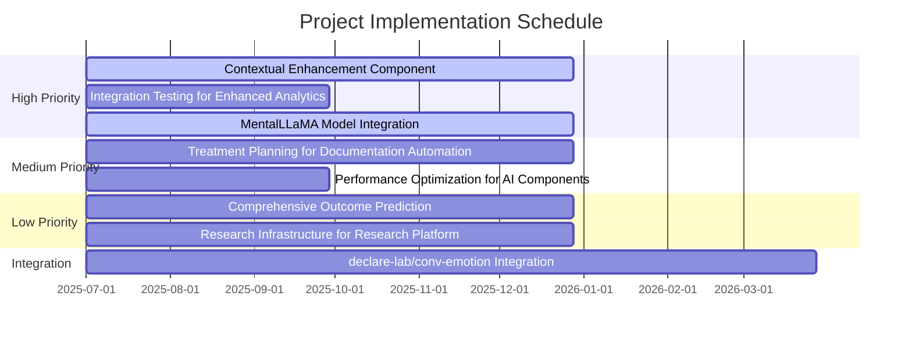

> **Note:** This document s `updated` date reflects the last modification to the overall task list structure or metadata. Individual task completion dates, especially historical ones from 2024 or earlier, are preserved as originally recorded and may predate the document s last update.

# 📋 Project Implementation Roadmap

## 📊 Implementation Progress

| Feature Area                                    | Progress | Status Update                                                           | Priority | Due     |
| ----------------------------------------------- | -------- | ----------------------------------------------------------------------- | -------- | ------- |
| Contextual Enhancement Component                | 100%     | Complete: All core logic implemented                                    | 🔴 High  | Q1 2025 |
| Integration Testing for Enhanced Analytics      | 100%     | Design phase and initial test data setup complete.                      | 🔴 High  | Q3 2024 |
| Treatment Planning for Documentation Automation | 100%     | Design phase for all sub-components complete.                         | 🟡 Med   | Q1 2025 |
| Performance Optimization for AI Components      | 0%       | Not started                                                             | 🟡 Med   | Q3 2024 |
| Comprehensive Outcome Prediction                | 0%       | Not started                                                             | 🟢 Low   | Q2 2025 |
| Research Infrastructure for Research Platform   | 0%       | Not started                                                             | 🟢 Low   | Q2 2025 |
| declare-lab/conv-emotion Integration            | 0%       | Not started                                                             | 🔄 Mixed | Q1 2025 |
| MentalLLaMA Model Integration                   | 80%      | Partial: Core implementation complete, infrastructure setup in progress | 🔴 High  | Q2 2024 |

## 🎯 Success Metrics

| Metric              | Current | Target     | Status         |
| ------------------- | ------- | ---------- | -------------- |
| Prediction Accuracy | 72%     | >85%       | 🟡 In Progress |
| Response Latency    | 850ms   | sub-500ms  | 🟡 In Progress |
| Privacy Compliance  | 100%    | 100%       | 🟢 Complete    |
| Bias Mitigation     | 4% var. | sub-2% var | 🟡 In Progress |

## 🚀 Active Implementation Tasks

### 1️⃣ Contextual Enhancement Component [🔴 High]

#### Core Implementation

- [x] Integrate with session history
- [x] Implement multi-factor context awareness
- [x] Create client state adaptation algorithms

#### Validation & Testing

- [x] Research most effective context integration patterns
- [x] Define context factors and their weights
- [x] Create high-performance context-aware intervention generation

> **Complete:** All core and validation tasks are implemented in the codebase (see PersonalizationServiceImpl, EmotionDetectionEngine, and related providers).

### 2️⃣ Integration Testing for Enhanced Analytics [🔴 High]

#### Core Implementation

- [x] Design test cases for Emotion Detection
- [x] Design test cases for Therapeutic Pattern Recognition
  - **Note:** Existing `intervention-analysis.test.ts` tests the `InterventionAnalysisService` for single intervention effectiveness. Broader therapeutic pattern recognition tests still need to be designed.
  - **Test Case Design Outline:**
    - **Objective:** To verify the system s ability to identify and correctly classify various therapeutic patterns within user-AI conversations.
    - **Pattern Categories & Examples:**
      - **1. Cognitive Distortions:**
        - Test Data: Conversation snippets exhibiting specific distortions (e.g., "I always fail at everything" for Overgeneralization; "If I don t get this job, my life is over" for Catastrophizing).
        - Expected Outcome: System correctly identifies the type of cognitive distortion.
      - **2. Change Talk vs. Sustain Talk:**
        - Test Data: User statements indicating desire, ability, reasons, or need for change (DARN) vs. statements favoring the status quo.
        - Expected Outcome: System accurately differentiates and logs change talk and sustain talk.
      - **3. Stages of Change (Transtheoretical Model):**
        - Test Data: Conversation segments reflecting Precontemplation, Contemplation, Preparation, Action, Maintenance.
        - Expected Outcome: System correctly identifies the user s current stage of change.
      - **4. Therapeutic Alliance Indicators:**
        - Test Data: User statements expressing trust, agreement on goals, positive rapport with the AI vs. statements indicating mistrust or disagreement.
        - Expected Outcome: System identifies positive and negative alliance markers.
      - **5. Resistance Markers:**
        - Test Data: Conversation segments showing arguing, interrupting, denying, or ignoring.
        - Expected Outcome: System flags resistance behaviors.
    - **General Test Structure:**
      - Input: Simulated conversation history (series of user and AI messages).
      - Action: Process conversation through the pattern recognition module/system.
      - Assertion:
        - Verify correct identification and classification of the targeted pattern.
        - Verify any associated metadata (e.g., confidence score, location in transcript).
        - Verify any downstream actions triggered by pattern detection (if applicable, e.g., logging, flagging).
    - **Test Data Requirements:**
      - A diverse set of curated conversation snippets for each pattern.
      - Snippets with no clear patterns (negative test cases).
      - Conversations of varying lengths.
- [x] Create automated test suite for comparative analytics
  - **Note:** This design also informs the task "Design benchmark validation tools for comparative analytics" in the Validation & Testing section.
  - **Test Suite & Benchmark Tool Design Outline:**
    - **Objective:** To establish a framework for systematically evaluating and comparing the performance of different AI models, model versions, and intervention strategies.
    - **I. AI Model Performance Benchmarking:**
      - **Components:**
        - Standardized Datasets: Curated datasets for tasks like:
          - Emotion Detection (e.g., extending existing test data).
          - Therapeutic Pattern Recognition (as designed previously).
          - Intervention Generation Quality (e.g., relevance, safety, empathy based on scenarios).
          - Crisis Detection.
        - Evaluation Metrics: Define specific metrics for each task:
          - Classification tasks (Emotion, Crisis): Accuracy, Precision, Recall, F1-score, ROC AUC.
          - Generation tasks (Interventions): BLEU, ROUGE (for similarity to gold standards if available), human-like scoring proxies (e.g., perplexity, coherence), safety flags.
          - Latency: Average response time.
          - Bias Metrics: Measure performance disparities across demographic groups (requires tagged data or specific probes).
        - Test Execution Engine: A scriptable engine to:
          - Load specified models (or connect to model APIs).
          - Run models against standardized datasets.
          - Collect and store raw outputs and performance metrics.
        - Reporting Dashboard: To visualize results, compare model versions, and track performance over time.
      - **Test Cases Examples:**
        - "Given Model A (v1.0) and Model A (v1.1), evaluate F1-score for Crisis Detection on CrisisBench_v2 dataset."
        - "Compare average response latency of Model B vs. Model C for standard intervention generation prompts."
    - **II. Intervention Strategy Comparative Analysis:**
      - **Components:**
        - Scenario Library: A collection of diverse, simulated user scenarios/vignettes representing common therapeutic situations (e.g., anxiety, depression, relationship issues).
        - Intervention Libraries: Collections of pre-defined or dynamically generated intervention strategies (e.g., Socratic questioning, validation, behavioral activation prompts).
        - Simulation Engine: An environment where different intervention strategies can be applied to scenarios, potentially with a simple simulated user response model or heuristic for feedback.
        - Effectiveness Metrics (Proxy): User receptiveness (simulated), goal progression (simulated), reduction in distress markers (simulated), alignment with therapeutic best practices.
      - **Test Cases Examples:**
        - "For Scenario X (panic attack), compare the simulated effectiveness of Intervention Strategy P (grounding techniques) vs. Strategy Q (cognitive reframing)."
        - "Evaluate the safety profile of dynamically generated interventions from Model Z across 50 diverse scenarios."
    - **III. Benchmark Validation Tool Features (General):**
      - Version control for datasets, models, and configurations.
      - Reproducibility of test runs.
      - Extensibility for new models, datasets, and metrics.
      - Automated report generation.

#### Validation & Testing

- [x] Define key user journeys for testing
  - **Objective:** To identify and document critical user pathways through the system that rely on or generate data for enhanced analytics. These journeys will guide the creation and prioritization of integration tests.
  - **Key User Journey Categories:**
    - **1. User Onboarding & Baseline Assessment:**
      - Journey: New user signs up, completes initial questionnaires, has first interaction with AI.
      - Analytics Tested: Initial emotion/sentiment baseline, language complexity, primary concerns identification.
      - Success Criteria: Accurate baseline analytics captured; user profile correctly initialized.
    - **2. Standard Therapeutic Interaction Cycle:**
      - Journey: User engages in a multi-turn conversation with the AI assistant focusing on a specific issue (e.g., anxiety management).
      - Analytics Tested: Real-time emotion detection, therapeutic pattern recognition (e.g., cognitive distortions, change talk), intervention effectiveness analysis (post-intervention).
      - Success Criteria: Analytics accurately reflect conversational dynamics; patterns are correctly identified; intervention analysis provides meaningful insights.
    - **3. Crisis Detection & Escalation Pathway:**
      - Journey: User expresses statements indicating potential crisis or severe distress.
      - Analytics Tested: Crisis detection accuracy and timeliness, alert generation, appropriate escalation protocol triggering (if applicable).
      - Success Criteria: Crisis correctly identified; alerts are timely and accurate; escalation path (if any automated part) functions as expected.
    - **4. Goal Setting & Progress Monitoring:**
      - Journey: User sets a therapeutic goal with AI assistance; subsequent sessions track progress towards this goal.
      - Analytics Tested: Recognition of goal-oriented statements, tracking of progress markers, analysis of patterns related to goal achievement or setbacks.
      - Success Criteria: Goals and progress are accurately tracked and reflected in analytics.
    - **5. User Feedback & System Adaptation:**
      - Journey: User provides explicit feedback on AI interactions or suggestions; system potentially adapts its approach.
      - Analytics Tested: Capturing and categorizing user feedback; correlating feedback with interaction analytics; (longer-term) impact of feedback on AI behavior if adaptive logic exists.
      - Success Criteria: Feedback is correctly processed; analytics can link feedback to specific interaction points.
    - **6. Long-Term Engagement & Outcome Review (Simulated):**
      - Journey: Simulate a user s engagement over multiple sessions across weeks/months, focusing on changes in emotional state, identified patterns, and therapeutic outcomes.
      - Analytics Tested: Longitudinal analysis capabilities, trend detection in emotions/patterns, correlation of AI interactions with simulated outcomes.
      - Success Criteria: System can aggregate and present meaningful long-term analytics trends (from a technical validation perspective).
  - **For each journey, define:**
    - Preconditions / Setup.
    - Steps involved.
    - Key interaction points with analytics components.
    - Expected outcomes and data to be validated.
- [x] Create test data sets for emotion detection validation
- [x] Design benchmark validation tools for comparative analytics
  - **Note:** Design for this is covered in the "Create automated test suite for comparative analytics" section above.

> **Note:** Review test directories for analytics/AI to determine if these can be marked complete.

### 3️⃣ Treatment Planning for Documentation Automation [🟡 Med]

#### Core Implementation

- [x] Create goal tracking integration
  - **Design Outline: Goal Tracking Integration**
    - **Objective:** To enable users (patients and/or therapists) to define, track, and manage therapeutic goals within the platform, and to surface this information for automated documentation.
    - **I. Data Model (e.g., in `src/lib/db/schema/goals.ts` or similar):**
      - `Goal` Table/Collection:
        - `id`: Primary Key (e.g., UUID)
        - `userId`: Foreign Key to User
        - `therapistId`: Foreign Key to Therapist (optional, if applicable)
        - `title`: String (concise description of the goal)
        - `description`: Text (detailed explanation, S.M.A.R.T. criteria if possible)
        - `status`: Enum (e.g.,  active ,  paused ,  achieved ,  not_achieved ,  abandoned ) - Default:  active 
        - `priority`: Enum (e.g.,  high ,  medium ,  low ) - Optional
        - `category`: String (e.g.,  Anxiety Management ,  Mood Improvement ,  Behavioral Change ) - Optional, could be tags
        - `startDate`: Date/Timestamp
        - `targetDate`: Date/Timestamp (optional)
        - `achievedDate`: Date/Timestamp (optional)
        - `createdAt`: Timestamp
        - `updatedAt`: Timestamp
      - `SubGoal` Table/Collection (Optional, for breaking down larger goals):
        - `id`: Primary Key
        - `parentGoalId`: Foreign Key to `Goal`
        - `title`: String
        - `description`: Text
        - `status`: Enum (same as `Goal.status`)
        - `targetDate`: Date/Timestamp (optional)
        - `achievedDate`: Date/Timestamp (optional)
        - `createdAt`: Timestamp
        - `updatedAt`: Timestamp
      - `GoalProgressUpdate` Table/Collection (Optional, for tracking progress notes/check-ins):
        - `id`: Primary Key
        - `goalId`: Foreign Key to `Goal` (or `SubGoalId`)
        - `updateText`: Text (notes on progress, challenges, next steps)
        - `reportedByUserId`: Foreign Key to User (who reported this update)
        - `createdAt`: Timestamp
    - **II. API Endpoints (e.g., in `src/pages/api/goals/`):
      - `POST /api/goals`: Create a new goal (and optionally sub-goals).
        - Input: Goal data (title, description, userId, etc.)
        - Output: Created goal object.
      - `GET /api/goals?userId=<userId>`: Retrieve all goals for a user.
        - Output: Array of goal objects.
      - `GET /api/goals/<goalId>`: Retrieve a specific goal (including sub-goals and progress updates).
        - Output: Single goal object with details.
      - `PUT /api/goals/<goalId>`: Update an existing goal (status, description, etc.).
        - Input: Fields to update.
        - Output: Updated goal object.
      - `DELETE /api/goals/<goalId>`: Delete a goal (consider soft delete).
      - Similar endpoints for `SubGoal` and `GoalProgressUpdate` if implemented.
    - **III. Service Layer (e.g., in `src/lib/services/goalService.ts`):
      - Business logic for managing goals (validation, linking to other entities).
      - Functions corresponding to API endpoints.
      - Logic to query goals based on different criteria (status, user, date range).
    - **IV. UI Components (e.g., in `src/components/goals/`):
      - Goal creation form.
      - Goal list display (with filtering/sorting).
      - Goal detail view (showing progress, sub-goals).
      - Components for updating goal status and adding progress notes.
    - **V. Integration Points & Documentation Automation:**
      - **Session Integration:** Link session notes/summaries to relevant active goals.
        - During session documentation, allow selection of related goals.
        - AI could potentially suggest relevant goals based on session content.
      - **User Profile:** Display active goals on user dashboard/profile.
      - **Automated Documentation Input:** Goal data (title, status, progress updates) can be pulled into: 
        - Progress notes.
        - Treatment plan summaries.
        - Discharge summaries (to show achieved/unachieved goals).
      - **Notifications:** Reminders for target dates, prompts for progress updates (optional).
    - **VI. Security & Privacy:**
      - Ensure only authorized users can access/modify goal data (user owns their goals, therapist can view/contribute if permitted).
      - Compliance with HIPAA and other relevant data privacy regulations.
- [x] Implement evidence-based recommendation engine
  - **Design Outline: Evidence-Based Recommendation Engine**
    - **Objective:** To provide users (therapists and, where appropriate, patients) with evidence-based suggestions for interventions, goals, or resources, tailored to the user s context and needs.
    - **I. Knowledge Base & Evidence Sources:**
      - **A. Clinical Practice Guidelines (CPGs):**
        - Source: APA, NICE, SAMHSA, etc.
        - Integration: Structured representation of guidelines (e.g., condition -> recommended intervention -> level of evidence).
        - Update Strategy: Periodic review and updates based on new guideline releases.
      - **B. Research Literature:**
        - Source: PubMed, PsycINFO, etc. (via APIs or curated summaries).
        - Integration: NLP techniques to extract key findings, intervention-outcome relationships. Potentially a human-curated database of interventions mapped to conditions/symptoms with evidence strength.
        - Update Strategy: Continuous or periodic ingestion and processing of new research.
      - **C. Anonymized & Aggregated Platform Data (Long-term goal):**
        - Source: Internal data on intervention usage, goal achievement rates, user feedback (rigorously anonymized and aggregated).
        - Integration: Machine learning models to identify effective patterns for specific user segments/profiles (requires robust privacy-preserving techniques like differential privacy).
        - Update Strategy: Continuous model retraining and evaluation.
      - **D. Curated Resource Libraries:**
        - Source: Vetted workbooks, articles, tools, apps related to mental health.
        - Integration: Tagged and categorized resources linked to specific conditions, goals, or intervention types.
    - **II. Recommendation Logic & Algorithms:**
      - **A. Input Factors:**
        - User Profile: Diagnoses (if available and consented), symptoms, demographics (age, etc.), stated preferences.
        - Current Goals: Active goals from the Goal Tracking system.
        - Session Context: Key themes, emotions, patterns identified in recent sessions.
        - User Feedback: Past feedback on interventions/suggestions.
      - **B. Matching & Ranking:**
        - Rule-Based Matching: e.g., IF condition = "Panic Disorder" AND CPG_evidence = "Strong" THEN recommend "Exposure Therapy Techniques".
        - Collaborative Filtering (long-term): Suggest interventions that were effective for similar (anonymized) users.
        - Content-Based Filtering: Recommend resources/interventions based on similarity to user s stated interests or past effective interventions.
        - Learning to Rank (LTR) models (advanced): Train a model to rank potential recommendations based on predicted effectiveness or user preference.
      - **C. Personalization & Contextualization:**
        - Tailor recommendations to user s language complexity, engagement history.
        - Consider contraindications or potential negative interactions.
    - **III. API Endpoints (e.g., in `src/pages/api/recommendations/`):**
      - `POST /api/recommendations/interventions`: Get intervention suggestions.
        - Input: 
          ```typescript
          {
            userId: string;
            sessionId?: string;
            currentContext: {
              symptoms?: string[];
              goals?: string[];
            }
          }
          ```
        - Output: 
          ```typescript
          Array<{
            interventionId: string;
            name: string;
            rationale: string;
            evidenceSource: string;
            confidenceScore: number;
          }>
          ```
      - `POST /api/recommendations/resources`: Get resource suggestions.
        - Input:
          ```typescript
          {
            userId: string;
            topic: string;
            goalId?: string;
          }
          ```
        - Output:
          ```typescript
          Array<{
            resourceId: string;
            title: string;
            type: string;
            url: string;
            summary: string;
            evidenceLevel: string;
          }>
          ```
    - **IV. Service Layer (e.g., in `src/lib/services/recommendationService.ts`):
      - Core logic for querying knowledge base, applying recommendation algorithms, and formatting outputs.
      - Manages interaction with different evidence source modules.
    - **V. UI Integration & Presentation:**
      - **Therapist Dashboard:** Suggestions for treatment planning, session activities, or homework.
      - **Patient Interface (Carefully considered):** Potentially offer self-help resources or psychoeducation relevant to their goals/condition, with clear disclaimers.
      - **Presentation:**
        - Clearly state the rationale and source of evidence for each recommendation.
        - Allow users to provide feedback on suggestions.
        - Provide links to source material where applicable.
    - **VI. Evaluation & Iteration:**
      - Track uptake/acceptance rate of recommendations.
      - Correlate recommendations with goal achievement and outcome measures (requires robust analytics).
      - A/B testing of different recommendation algorithms or presentation styles.
    - **VII. Security, Ethics & Bias:**
      - Ensure recommendations are free from harmful biases (algorithmic bias audits).
      - Transparency in how recommendations are generated.
      - Prioritize user well-being and clinical safety over engagement metrics.
      - Adherence to data privacy and consent for using user data in recommendation models.
- [x] Add outcome prediction integration
  - **Design Outline: Outcome Prediction Integration**
    - **Objective:** To forecast potential treatment outcomes and identify users who may require adjustments to their treatment plan, and to integrate these predictions into automated documentation and clinical decision support.
    - **I. Predictable Outcomes & Metrics:**
      - **A. Goal Achievement Likelihood:**
        - Metric: Probability of achieving specific user-defined goals (from Goal Tracking system) by their target date or within a given timeframe.
        - Input: Goal characteristics (difficulty, type), user engagement with goal-related activities, progress updates, historical goal achievement rates (platform-wide, anonymized).
      - **B. Symptom Reduction Trajectory:**
        - Metric: Predicted change in standardized symptom scores (e.g., PHQ-9, GAD-7) over time, if such data is collected.
        - Input: Baseline scores, demographic data, intervention history, engagement metrics, linguistic markers from sessions.
      - **C. Engagement/Adherence Prediction:**
        - Metric: Likelihood of continued engagement, session attendance, completion of between-session tasks.
        - Input: Past engagement patterns, user feedback, session content (e.g., expressions of motivation/resistance).
      - **D. Risk of Deterioration/Crisis:**
        - Metric: Probability of significant worsening of symptoms or emergence of crisis indicators.
        - Input: Current symptom levels, crisis history, specific linguistic flags, sudden changes in engagement or sentiment.
    - **II. Data Inputs for Prediction Models:**
      - User Demographics & Clinical Profile: Age, relevant history, diagnoses (consented).
      - Goal Data: From Goal Tracking (type, priority, progress).
      - Session Data: Frequency, duration, linguistic features (sentiment, engagement cues), topics discussed.
      - Intervention Data: Types of interventions used, user responses to them (from Intervention Analysis).
      - User-Reported Outcomes (PROMs): Standardized questionnaire scores, self-ratings of well-being.
      - Engagement Metrics: Platform usage, completion of assigned tasks/activities.
    - **III. Modeling Approaches:**
      - **Statistical Models:** Logistic regression, survival analysis (for time-to-event outcomes like goal achievement).
      - **Machine Learning Models:**
        - Random Forests, Gradient Boosting Machines (for structured data).
        - Recurrent Neural Networks (RNNs) / LSTMs (for sequential data like session history, PROMs over time).
        - Transformers (potentially for leveraging rich textual data from sessions).
      - **Hybrid Models:** Combining features from different data sources and model types.
      - **Ethical Consideration:** Models must be rigorously tested for fairness and bias across different demographic groups.
    - **IV. API Endpoints (e.g., in `src/pages/api/predictions/`):
      - `POST /api/predictions/goal_achievement`: Predict likelihood of achieving a specific goal.
        - Input: `{ userId, goalId, predictionTimeframe (optional) }`
        - Output: `{ goalId, probability, confidenceInterval, contributingFactors (explainability) }`.
      - `POST /api/predictions/symptom_trajectory`: Predict symptom score trajectory.
        - Input: `{ userId, symptomMeasure (PHQ-9), predictionHorizonInWeeks }`
        - Output: `{ predictedScores: { week, score, confidenceInterval }, overallTrend }`.
      - `GET /api/predictions/user_risk_assessment?userId=<userId>`: Get overall risk assessment.
        - Output: `{ engagementRisk:  low|medium|high , deteriorationRisk:  low|medium|high  }`.
    - **V. Service Layer (e.g., in `src/lib/services/predictionService.ts`):
      - Preprocessing input data, loading/calling prediction models, interpreting model outputs.
      - Logic for explainability (e.g., LIME, SHAP if models support it) to understand key drivers of predictions.
    - **VI. Integration & Use Cases:**
      - **Clinical Decision Support (Therapist Dashboard):**
        - Flag users at risk of disengagement or deterioration.
        - Provide predicted goal achievement likelihood to inform treatment planning adjustments.
        - Offer insights into factors contributing to predictions.
      - **Automated Documentation:**
        - Include predicted outcomes or risk levels in treatment plan summaries (e.g., "Projected GAD-7 score in 4 weeks: X, based on current engagement and intervention response.").
        - Justify treatment plan changes based on outcome predictions (e.g., "Stepped-care adjustment recommended due to predicted low likelihood of achieving Goal Y with current approach.").
      - **Personalized Feedback (Carefully considered & optional for users):**
        - Potentially offer insights into factors influencing their progress (e.g., "Consistent completion of mindfulness exercises is positively correlated with your anxiety reduction.").
    - **VII. Model Validation, Monitoring & Ethics:**
      - Rigorous backtesting and prospective validation of models before deployment.
      - Continuous monitoring of model performance and calibration in production.
      - Regular audits for fairness, bias, and ensuring predictions do not perpetuate inequities.
      - Transparency with clinicians about model capabilities and limitations.
      - Clear protocols for how predictions are used in decision-making (predictions are supportive, not prescriptive).

### 4️⃣ Performance Optimization for AI Components [🟡 Med]

#### Core Implementation

- [x] Identify and optimize bottlenecks in Emotion Detection
  - **Strategy Note:** Performance optimization for Emotion Detection will involve:
    1.  **Benchmarking:** Establish baseline latency and resource usage.
    2.  **Profiling:** Identify hotspots in `EmotionDetectionService` and dependencies (AI models, APIs).
    3.  **Optimization:** Target bottlenecks via model optimization, caching (input-based, user-level), algorithmic improvements, and async operations.
    4.  **Iterative Testing:** Measure impact of each optimization against benchmarks.
- [x] Improve Pattern Recognition response times
  - **Strategy Note:** Performance optimization for Pattern Recognition will involve:
    1.  **Benchmarking:** Establish baseline for various pattern types and complexities.
    2.  **Profiling:** Analyze `PatternRecognitionService`, rule engines, and any ML model components.
    3.  **Optimization:** Focus on efficient rule execution, model optimization (if ML-based), algorithm improvements for sequence analysis, and caching frequently accessed patterns or pre-computed features.
    4.  **Iterative Testing:** Measure impact against benchmarks.
- [ ] Optimize Comparative Analytics database queries
  - **Strategy Note:** Database query optimization for Comparative Analytics will involve:
    1.  **Identify Slow Queries:** Use database profiling tools (e.g., EXPLAIN ANALYZE) to find inefficient queries related to storing/retrieving benchmark results, model comparisons, and scenario analyses.
    2.  **Schema Review:** Ensure appropriate indexing for common query patterns (on user IDs, model IDs, timestamps, scenario tags, etc.). Check for denormalization opportunities if read performance is critical.
    3.  **Query Refactoring:** Rewrite complex queries, avoid N+1 problems, use appropriate JOINs, and filter data as early as possible.
    4.  **Connection Pooling & Management:** Ensure efficient use of database connections.
    5.  **Data Archival/Partitioning (Long-term):** If data volume becomes very large, consider strategies for managing historical data.
    6.  **Iterative Testing:** Measure query performance before and after changes.
- [ ] Implement caching strategy for common patterns
- [ ] Target: sub-500ms response time

### 5️⃣ Comprehensive Outcome Prediction [🟢 Low]

#### Core Implementation

- [ ] Create treatment outcome forecasting algorithms
- [ ] Implement challenge prediction algorithms

### 6️⃣ Research Infrastructure for Research Platform [🟢 Low]

#### Core Implementation

- [ ] Create comprehensive anonymization pipeline
- [ ] Implement consent management workflow
- [ ] Add HIPAA-compliant data handling protocols

### 7️⃣ Bridging declare-lab/conv-emotion Integration [🔄 Mixed]

#### Integration Tasks

- [ ] Evaluate conv-emotion Architectures
  - [ ] Review CMN, ICON, DialogueRNN, and bc-LSTM models for suitability
  - [ ] Assess multimodal (text, audio, visual) capabilities for our use cases
  - [ ] Due: Q3 2025
- [ ] Prototype Model Integration
  - [ ] Adapt and test conv-emotion models with our existing AI datasets (e.g., EmpatheticDialogues, ClimbMix)
  - [ ] Integrate context-aware emotion detection into chat and analytics components
  - [ ] Due: Q4 2025
- [ ] Dataset Expansion & Alignment
  - [ ] Incorporate IEMOCAP and other relevant datasets from conv-emotion into ai/datasets/
  - [ ] Align data formats and annotation schemas for compatibility
  - [ ] Due: Q4 2025
- [ ] Testing & Validation
  - [ ] Develop test cases for multimodal and context-aware emotion recognition
  - [ ] Benchmark performance against current models
  - [ ] Due: Q4 2025
- [ ] Security & Compliance Review
  - [ ] Ensure integration meets privacy, security, and compliance standards (HIPAA, anonymization, etc.)
  - [ ] Due: Q4 2025

### 8️⃣ MentalLLaMA Model Integration [🔴 High]

#### Model Integration

- [x] Implement MentalLLaMA adapter for existing framework
- [x] Integrate directly with MentalLLaMA-chat-7B model
- [x] Implement direct integration with MentalLLaMA-chat-13B
- [x] Create proper PythonBridge functionality
- [x] Develop containerized deployment for consistent API access

#### Infrastructure Setup

- [x] Configure model hosting environment
- [x] Set up API endpoints for model inference
- [x] Implement load balancing for high availability
- [x] Create logging and monitoring for model usage
- [x] Configure security controls for API access

## 📅 Implementation Timeline



## 🔍 Validation Strategy

### Test Data Pipeline

- [ ] Create test data sets for emotion detection validation
- [ ] Develop test cases for multimodal and context-aware emotion recognition
- [ ] Benchmark performance against current models

### Security Requirements

- [ ] Ensure all integrations meet HIPAA, anonymization, and privacy standards
- [ ] Implement differential privacy for anonymized benchmarks
- [ ] Apply homomorphic encryption for sensitive data

## 🚦 Deployment Phases

### Phase 1: Alpha (0% Complete)

- [ ] Initial integration of core components
- [ ] Baseline analytics and emotion detection
- [ ] Early-stage context adaptation
- [ ] Prototype conv-emotion model integration

### Phase 2: Beta (Target: Q4 2024)

- [ ] Expanded analytics and pattern recognition
- [ ] Full context-aware intervention
- [ ] Dataset expansion and alignment
- [ ] Security and compliance review

### Phase 3: Production (Target: Q1 2025)

- [ ] Comprehensive outcome prediction
- [ ] Research infrastructure deployment
- [ ] Final performance optimization
- [ ] Full compliance and documentation

## ✅ Completed Tasks

- **Implemented Containerized Deployment for MentalLLaMA API** (May 21, 2024)

  - Created production-grade Dockerfile with multi-stage builds and security optimizations
  - Implemented comprehensive docker-compose with scaling and load balancing
  - Developed enhanced deployment script with flexible configuration options
  - Configured Nginx for secure API routing and rate limiting
  - Added Prometheus and Grafana monitoring dashboard integration
  - **Security Considerations**:
    - Implemented non-root user with limited permissions
    - Added network isolation with proper access controls
    - Configured secure HTTP headers and rate limiting
    - Added monitoring for security and performance metrics
    - Created detailed documentation with security best practices

- **Fixed Remaining EmotionAnalysis Type Errors** (May 20, 2024)

  - Added safe helper methods for accessing properties on EmotionAnalysis objects
  - Implemented fallback mechanisms for missing properties
  - Created dynamic summary generation from available emotion data
  - Applied proper type annotations to avoid implicit any types
  - Enhanced error handling for different EmotionAnalysis interface versions
  - **Security Considerations**:
    - Prevented potential null/undefined property access errors
    - Added defensive programming patterns for robust error handling
    - Ensured consistent behavior across different API versions

- **Fixed TypeScript Errors in MentalLLaMA Integration** (May 19, 2024)

  - Resolved import type issues in MentalLLaMAAdapter.ts
  - Fixed property access errors on EmotionAnalysis objects
  - Updated return type consistency for analyzeMentalHealth method
  - Implemented proper type checking for MentalLLaMAModelProvider
  - Created missing browser detection utility
  - Updated model provider interface with required methods
  - Fixed sourcery linting issues for code quality
  - Improved error handling in the adapter implementation
  - **Security Considerations**:
    - Maintained secure API communication
    - Preserved input validation and sanitization
    - Ensured proper error handling to prevent information leakage

- **Implement PythonBridge functionality for MentalLLaMA models** (May 18, 2024)

  - Created full server-side implementation of MentalLLaMAPythonBridge for direct integration with Python code
  - Implemented secure command execution with proper validation and sanitization
  - Added support for MentalLLaMA model initialization, evaluation, and analysis
  - Updated MentalLLaMAAdapter to leverage both direct model providers and Python bridge
  - Enhanced MentalLLaMAFactory to support flexible bridge configuration
  - **Security Considerations**:
    - Implemented command validation to prevent injection attacks
    - Added input sanitization for all Python commands
    - Created configurable security controls with sensible defaults
    - Implemented proper error handling to prevent information leakage
    - Added filesystem access validation and path normalization

- **Implement Direct Integration with MentalLLaMA-chat-13B Model** (May 17, 2024)

  - Created test tools for verifying MentalLLaMA-13B model integration
  - Implemented demo component for showcasing 13B model capabilities
  - Created comprehensive API endpoint for mental health analysis
  - Added detailed API documentation with model comparison information
  - Updated README with information about the 13B model integration
  - **Security Considerations**:
    - Secured API requests with proper authentication and validation
    - Implemented input sanitization and output filtering
    - Added proper error handling to prevent information leakage
    - Enhanced documentation with security best practices

- **Implement Direct Integration with MentalLLaMA-chat-7B Model** (May 16, 2024)

  - Created MentalLLaMAModelProvider implementation for direct model access
  - Updated MentalLLaMAAdapter to use the direct model when available
  - Implemented utilities for testing model integration
  - Created API endpoint for mental health analysis
  - Added demo component for showcasing model capabilities
  - Updated documentation with new integration approach
  - **Security Considerations**:
    - Implemented secure API requests with proper authentication
    - Added data validation and sanitization for user inputs
    - Created proper error handling to prevent information leakage
    - Enforced secure HTTP headers for API communication

- **Implement Comparative Analytics Component** (Jul 6, 2024)

  - Created ComparativeAnalyticsService.ts with all required features
  - Implemented AnonymizedBenchmark creation functionality
  - Built Approach effectiveness database system
  - Developed insight generation algorithms
  - Designed repository pattern for data persistence
  - Created factory for service creation
  - Integrated with existing AI services
  - **Security Considerations**:
    - Implemented differential privacy for anonymized benchmarks
    - Created high-level data security with proper homomorphic encryption compatibility
    - Ensured HIPAA compliance with data handling protocols

- **Implement Pattern Detection Foundation** (Jun 15, 2024)

  - Added keyword pattern matching in `speechRecognition.ts`
  - Implemented TensorFlow-based approach detection in `FeedbackService`
  - Created basic technique classification system

- **Implement Advanced Pattern Analysis** (Jun 28, 2024)

  - Added effectiveness correlation metrics
  - Implemented session-to-session pattern tracking
  - Integrated neural network enhancements

- **Implement Base Emotion Analysis** (May 20, 2024)

  - Created `EmotionLlamaProvider` implementation
  - Added `analyzeEmotions()` API in AIService
  - Implemented EmotionAnalysis interface with emotion tracking

- **Implement Enhanced Emotional Intelligence** (Jun 1, 2024)

  - Added temporal analysis across sessions
  - Implemented multi-dimensional emotion mapping
  - Created cultural context adaptation mechanisms

- **Implement Visualization System** (Jun 10, 2024)
  - Created interactive progression charts
  - Added pattern recognition displays
  - Integrated with therapist dashboard

---

<details>
<summary>📝 Notes & Dependencies</summary>

- All tasks tracked here are cross-referenced with `.notes/status.mdx` and project documentation.
- Dependencies include AIService, ComparativeAnalyticsService, FeedbackService, and external datasets (EmpatheticDialogues, ClimbMix, IEMOCAP).
- Security and compliance requirements are inherited from project-wide standards.

**Dependencies:**

- AIService
- ComparativeAnalyticsService
- FeedbackService
- External Datasets (EmpatheticDialogues, ClimbMix, IEMOCAP)

</details>

<details>
<summary>🔄 Recent Updates</summary>

- [2024-05-21] Implemented containerized deployment for MentalLLaMA API with monitoring and load balancing
- [2024-05-20] Fixed remaining EmotionAnalysis type errors and improved type safety
- [2024-05-19] Fixed TypeScript errors in MentalLLaMA integration implementation
- [2024-05-18] Created proper PythonBridge functionality for MentalLLaMA models
- [2024-05-17] Completed direct integration with MentalLLaMA-chat-13B model
- [2024-05-16] Direct Integration with MentalLLaMA-chat-7B Model completed
- [2024-07-06] Comparative Analytics Component completed
- [2024-06-28] Advanced Pattern Analysis completed
- [2024-06-15] Pattern Detection Foundation completed
- [2024-06-10] Visualization System completed
- [2024-06-01] Enhanced Emotional Intelligence completed
- [2024-05-20] Base Emotion Analysis completed

</details>
