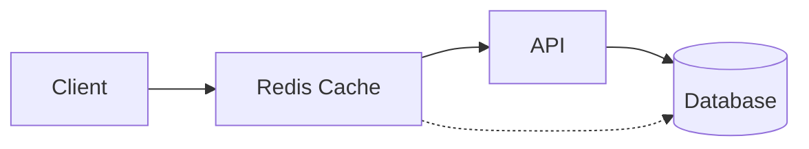
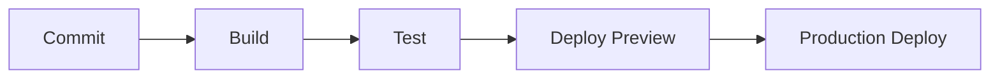

import Frame from '../../components/docs/Frame.astro';
import Note from '../../components/docs/Note.astro';
import Tabs from '../../components/docs/Tabs.astro';
import Tab from '../../components/docs/Tab.astro';
import Steps from '../../components/docs/Steps.astro';
import Cards from '../../components/docs/Cards.astro';
import Card from '../../components/docs/Card.astro';

# Pixelated Empathy Architecture

## System Overview

Pixelated Empathy is built on a modern, secure, and scalable architecture that combines the best practices from various platforms while maintaining strong privacy and security measures through Zero-Knowledge Encryption and HIPAA compliance.

<Frame>
  ```mermaid
  graph TB
    subgraph Frontend
      UI[UI Components]
      State[State Management]
      ZKClient[ZK Client]
    end

    subgraph Backend
      API[API Layer]
      Auth[Authentication]
      ZKServer[ZK Server]
      Queue[Message Queue]
    end

    subgraph Database
      Supabase[(Supabase)]
      Cache[(Redis Cache)]
    end

    UI --> State
    State --> ZKClient
    ZKClient --> API
    API --> Auth
    API --> ZKServer
    Auth --> Supabase
    ZKServer --> Queue
    Queue --> Supabase
    API --> Cache

````
</Frame>

## Core Components

### Frontend Architecture

<Tabs>
<Tab title="UI Layer">
  The UI layer is built using React and Next.js, incorporating design elements from Liftoff's interview platform:

  - **Component Structure**
    - Atomic Design Principles
    - Shared Component Library
    - Theme Provider (Dark/Light modes)
    - Responsive Layout System

  - **State Management**
    - React Context for global state
    - React Query for server state
    - Local storage for persistence
    - Secure credential handling
</Tab>

<Tab title="Data Flow">
  Data flow follows unidirectional principles:

  1. User actions trigger state changes
  2. State updates propagate to components
  3. Side effects handled by middleware
  4. Server state synchronized via WebSocket
</Tab>
</Tabs>

### Backend Architecture

<div style="display: grid; grid-template-columns: repeat(auto-fit, minmax(300px, 1fr)); gap: 1rem; margin: 1rem 0;">

<div style="border: 1px solid #e5e7eb; border-radius: 0.5rem; padding: 1rem;">
<h4><strong>API Layer</strong></h4>

- RESTful endpoints
- GraphQL interface
- WebSocket connections
- Rate limiting
- Request validation

</div>

<div style="border: 1px solid #e5e7eb; border-radius: 0.5rem; padding: 1rem;">
<h4><strong>Authentication</strong></h4>

- Supabase Auth integration
- JWT token management
- Role-based access control
- Session handling

</div>

<div style="border: 1px solid #e5e7eb; border-radius: 0.5rem; padding: 1rem;">
<h4><strong>Zero-Knowledge System</strong></h4>

- End-to-end encryption
- Client-side key generation
- Secure message passing
- Zero-knowledge proofs

</div>

</div>

## Database Design

### Supabase Schema

```sql
-- Core Tables
CREATE TABLE users (
id UUID PRIMARY KEY DEFAULT uuid_generate_v4(),
email TEXT UNIQUE NOT NULL,
encrypted_data JSONB,
settings JSONB DEFAULT '{}'::jsonb,
created_at TIMESTAMPTZ DEFAULT NOW(),
updated_at TIMESTAMPTZ DEFAULT NOW()
);

CREATE TABLE sessions (
id UUID PRIMARY KEY DEFAULT uuid_generate_v4(),
user_id UUID REFERENCES users(id),
metadata JSONB,
started_at TIMESTAMPTZ DEFAULT NOW(),
ended_at TIMESTAMPTZ
);

CREATE TABLE messages (
id UUID PRIMARY KEY DEFAULT uuid_generate_v4(),
session_id UUID REFERENCES sessions(id),
encrypted_content TEXT NOT NULL,
metadata JSONB,
created_at TIMESTAMPTZ DEFAULT NOW()
);
````

## Security Architecture

<Steps>
  ### 1. Authentication Flow
  - User registration/login via Supabase Auth
  - JWT token generation and validation
  - Secure session management

### 2. Zero-Knowledge Implementation

- Client-side key generation
- End-to-end encryption of sensitive data
- Zero-knowledge proof verification

### 3. Data Protection
  - Encrypted data storage in Supabase
  - Secure key management
  - Regular security audits
  </Steps>

## Integration Points

### Liftoff Features

<details>
<summary><strong>UI Components</strong></summary>

- Chat interface adaptation 
- Dashboard layouts 
- Form components
- Navigation elements

</details>

<details>
<summary><strong>State Management</strong></summary>

- Real-time updates 
- Cache management 
- Optimistic updates 
- Error handling

</details>

### PocketBase Inspired Features

<details>
<summary><strong>Authentication System</strong></summary>

- Adapted for Supabase 
- Enhanced with ZK principles 
- Role-based access control

</details>

<details>
<summary><strong>API Structure</strong></summary>

- RESTful endpoints 
- Real-time subscriptions 
- Request validation

</details>

## Performance Considerations

### Caching Strategy



- **Client-side caching**

  - React Query cache
  - Service Worker cache
  - Local storage cache

- **Server-side caching**
  - Redis cache layer
  - Database query cache
  - CDN caching

### Optimization Techniques

<div style="display: grid; grid-template-columns: repeat(auto-fit, minmax(300px, 1fr)); gap: 1rem; margin: 1rem 0;">

<div style="border: 1px solid #e5e7eb; border-radius: 0.5rem; padding: 1rem;">
<h4><strong>Frontend Optimization</strong></h4>

- Code splitting
- Lazy loading  
- Image optimization
- Bundle size reduction

</div>

<div style="border: 1px solid #e5e7eb; border-radius: 0.5rem; padding: 1rem;">
<h4><strong>Backend Optimization</strong></h4>

- Query optimization
- Connection pooling
- Background job processing
- Resource scaling

</div>

</div>

## Deployment Architecture

<Frame>
  ```mermaid
  graph TB
    subgraph Production
      LB[Load Balancer]
      App1[App Server 1]
      App2[App Server 2]
      Cache[(Redis)]
      DB[(Supabase)]
    end

    Client --> LB
    LB --> App1
    LB --> App2
    App1 --> Cache
    App2 --> Cache
    App1 --> DB
    App2 --> DB

````
</Frame>

### Infrastructure Components

- **Frontend**
- Vercel deployment
- Edge functions
- CDN distribution

- **Backend**
- Containerized services
- Auto-scaling groups
- Load balancing

- **Database**
- Supabase managed instance
- Read replicas
- Backup strategy

## Monitoring & Logging

### Observability Stack

- **Application Monitoring**
- Error tracking
- Performance metrics
- User analytics

- **Infrastructure Monitoring**
- Server metrics
- Database metrics
- Cache performance

- **Security Monitoring**
- Audit logs
- Access logs
- Security alerts

## Development Workflow

### Local Development

```bash
# Frontend development
pnpm dev

# Backend development
pnpm backend:dev

# Database migrations
pnpm db:migrate

# Testing
pnpm test
````

### CI/CD Pipeline



<Note>
  This architecture documentation is maintained alongside the codebase and
  updated as the system evolves. For implementation details of specific
  components, refer to the respective documentation sections.
</Note>
