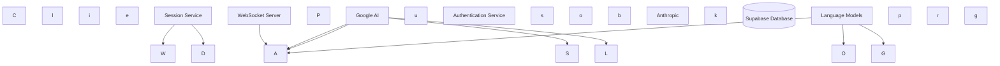
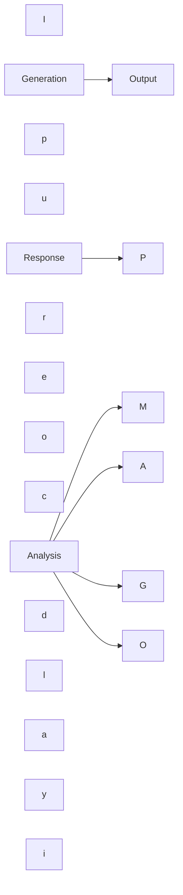

## Overview

Pixelated is built on a modern, scalable architecture that prioritizes security, real-time communication, and AI integration. The system consists of several key components working together to provide a seamless experience.

<Frame>

</Frame>

## Core Components

### Client Application

The frontend is built with:

- Vite for development and building
- React for UI components
- WebSocket for real-time communication
- End-to-end encryption for secure messaging

### API Gateway

The API gateway handles:

- Request routing
- Authentication
- Rate limiting
- Request validation
- CORS configuration

### Authentication Service

Built on Supabase Auth, providing:

- User registration and login
- Session management
- Password reset flows
- Role-based access control
- JWT token management

### Session Service

Manages therapy sessions with:

- Real-time communication
- Session state management
- Message persistence
- Analytics and reporting
- Crisis detection

### AI Service

Integrates multiple AI models for:

- Message processing
- Sentiment analysis
- Topic extraction
- Crisis detection
- Response suggestions

### WebSocket Server

Handles real-time communication:

- Secure message delivery
- Presence management
- Heartbeat monitoring
- Connection recovery

### Database

Uses Supabase (PostgreSQL) for:

- User data
- Session records
- Message history
- Analytics data
- System configuration

## Security Architecture

### Authentication Flow

<Frame>
```mermaid
sequenceDiagram
  participant Client
  participant API
  participant Auth
  participant DB
  C
  l
  i
  e
  n
  t->>API: Login Request
  A
  P
  I->>Auth: Validate Credentials
  A
  u
  t
  h->>DB: Check User
  D
  B-->>Auth: User Data
  A
  u
  t
  h-->>API: JWT Token
  A
  P
  I-->>Client: Session Token
```
</Frame>

### Data Security

1. **Encryption**

   - End-to-end encryption for messages
   - At-rest encryption for stored data
   - TLS for all API communication

2. **Access Control**

   - Role-based access control
   - Row-level security in database
   - Token-based authentication
   - API key management

3. **Audit Logging**
   - Security event logging
   - Access pattern monitoring
   - Error tracking
   - Performance metrics

## AI Integration

### Model Pipeline

<Frame>

</Frame>

### Model Selection

The system dynamically selects the most appropriate AI model based on:

- Task requirements
- Response time needs
- Cost considerations
- Availability
- Specialization

## Scalability

### Horizontal Scaling

Components that can be horizontally scaled:

- API servers
- WebSocket servers
- AI processing nodes
- Database reads

### Vertical Scaling

Resources that benefit from vertical scaling:

- Database writes
- AI model inference
- Real-time processing

## Monitoring

### System Health

Monitored metrics include:

- API response times
- WebSocket connections
- Database performance
- AI model latency
- Error rates

### Business Metrics

Tracked indicators include:

- Active sessions
- User engagement
- AI response quality
- Crisis detection accuracy
- System usage patterns

## Development

### Local Setup

Development environment requires:

- Node.js >= 16.x
- Python >= 3.11
- Local database
- Environment configuration

### Deployment

Deployment options include:

- Docker containers
- Kubernetes clusters
- Cloud services (AWS, GCP)
- Custom infrastructure

## Next Steps

<CardGroup>
  <Card title="Authentication" icon="lock" href="/core/authentication">
    Learn about the authentication system
  </Card>
  <Card title="Sessions" icon="messages" href="/core/sessions">
    Understand session management
  </Card>
  <Card title="AI Integration" icon="robot" href="/core/ai-integration">
    Explore AI capabilities
  </Card>
</CardGroup>
